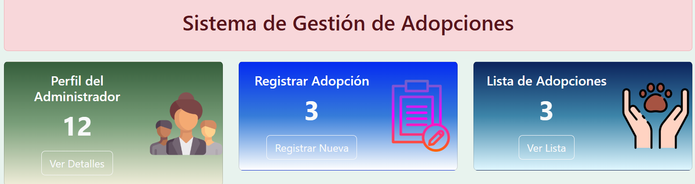

## Practicasprofesionalizacion
** Instalacion de archivos requeridos **
## Crear el entorno virtual
python -m venv venv

## Crear el archivo
pip freeze > requirements.txt

**Instalarlo**
pip install -r requirements.txt
## RECURSOS
Python 3.13.5

microframework web
flask

Gestor de base de datos:
MySql

## Vistas principal

## Vistas de acceso

## Vistas dashboard (panel)

