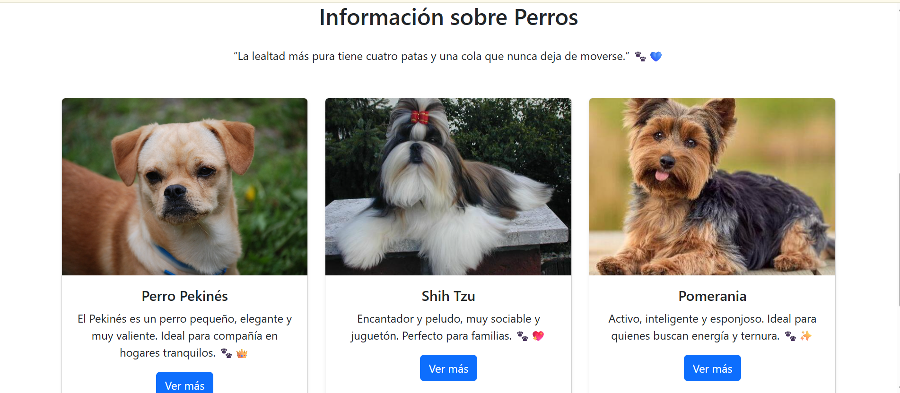

## Instalacion de archivos requeridoas

**Crear el entorno virtual:**
python -m venv venv

**Crear el archivo:**
pip freeze > requirements.txt

**Instalarlo**
pip install -r requirements.txt

**Instalarlo**
pip install gunicorn

## RECURSOS:
Python 3.13.5

microframework web

flask

Gestor de base de datos:
MySql

## Vistas principal

## Vistas de acceso

## Vistas dashboard (panel)

